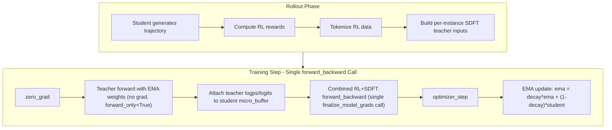

# SDFT Auxiliary Loss for 30B Training

## 0. Worktree Setup (DONE)

Worktree at `/home/ryan/SkyRL-sdft` on branch `ryan-sdft-aux-loss`.

## Architecture




## Housekeeping

- Delete stale plan file: `/home/ryan/.cursor/plans/sdft_auxiliary_loss_30b_65e65f6b.plan.md`
- Delete stale plan file: `/home/ryan/.cursor/plans/sdft_aux_loss_implementation_81551852.plan.md`
- Update `/home/ryan/.cursor/skills/skyrl-codebase-reference/SKILL.md` with `finalize_model_grads` hazard (general Megatron knowledge)

## Why EMA is Required

Paper ablates three teacher parameterizations (Figure 8):

- **Frozen base model**: stable but inferior
- **Live student weights**: unstable due to feedback loops
- **EMA of student weights**: stable and best results

EMA adds one clone of the per-GPU parameter shard (same memory as model params on that GPU). With H200 at 141 GB and optimizer CPU-offloaded, this fits if we reduce `gpu_memory_utilization` slightly (see Memory Budget).

## Production Parallelism Config

From [run_biomni_qwen30ba3b_rubric_gspo_tis.sh](skyrl-agent/examples/run_biomni/run_biomni_qwen30ba3b_rubric_gspo_tis.sh):

- **8 GPUs** (1 node x 8 H200s), **TP=2, PP=1, CP=4, EP=8**
- `micro_train_batch_size_per_gpu=1`, `use_sample_packing=true`
- `gpu_memory_utilization=0.3` (vLLM)
- Optimizer: fully CPU-offloaded
- Max prompt: 40960, max response: 4096, vLLM max model len: 47000

**How CP is handled** (critical for both estimators):

`postprocess_packed_seqs` in [megatron_utils.py](skyrl-train/skyrl_train/distributed/megatron/megatron_utils.py) lines 403-410 already gathers logits across CP ranks before the loss/collection callback receives them:

```python
if cp_size > 1:
    output_list = [torch.empty_like(output) for _ in range(cp_size)]
    torch.distributed.all_gather(output_list, output.detach(), group=mpu.get_context_parallel_group())
    output_list[mpu.get_context_parallel_rank()] = output  # local rank retains grad
```

Key consequences:

1. By the time the callback (loss_func/collection_func) receives `logits`, they are already `[B, S, V/TP]` -- full sequence, TP-sharded vocab. This is why `from_parallel_logits_to_logprobs` is called with `cp_group=None`.
2. Non-local CP outputs are `detach()`ed. Only the local CP rank's token positions retain gradients. The zig-zag CP load balancing assigns chunk 7 (tail of sequence, containing most/all response tokens) to cp_rank 0.
3. Backward: each CP rank only gets gradients at its local positions. `finalize_model_grads` all-reduces parameter gradients across all ranks (including CP), correctly summing each rank's contribution.

**Both REINFORCE and full-vocab KL work correctly with TP=2, CP=4** -- no CP=1 restriction needed.

## 1. Per-Instance GWAS Demonstration

**File:** [gwas_variant_prioritization.py](skyrl-agent/skyrl_agent/agents/biomni_codeact/task/gwas_variant_prioritization.py)

Add `get_demonstration(index)` returning a directly actionable demonstration for that training instance:

```python
def get_demonstration(self, index):
    ex = self.get_example(index)
    gt_variant = ex["answer"]
    prompt = ex["prompt"]

    trait = None
    candidates = []
    for line in prompt.splitlines():
        if "GWAS phenotype:" in line:
            trait = line.split(":", 1)[1].strip()
        if "Variants:" in line:
            cand_str = line.split(":", 1)[1]
            candidates = [c.strip() for c in cand_str.split(",") if c.strip()]
    n_candidates = len(candidates)

    return f"""The top associated variant is {gt_variant}.

Here is the recommended workflow:

Step 1 — Direct GWAS association evidence for "{trait}":
Use authoritative GWAS resources (GWAS Catalog, Open Targets Genetics, or large
biobank portals) to query associations for EACH of the {n_candidates} candidate
variants with "{trait}". For each variant, retrieve at minimum p-value AND effect
size (OR or beta), noting study context (cohort, ancestry, sample size) and
replication where available.

Step 2 — PheWAS / cross-phenotype expansion:
Expand to related traits or run a PheWAS-style scan with biological justification.
Check whether {gt_variant}'s signal is consistent across related endpoints. Flag
pleiotropy if present.

Step 3 — Variant-to-gene mapping:
Map {gt_variant} to effector gene(s) using eQTL/colocalization, chromatin
interaction data, or fine-mapping evidence. Tie the gene's function specifically
to "{trait}".

Step 4 — Functional annotation independent of p-values:
Evaluate at least 2 distinct functional evidence types (coding consequence,
CADD/SpliceAI, regulatory overlap, conservation, tissue-relevant eQTL) and
explain how they influence the ranking.

Step 5 — Systematic ranking of ALL {n_candidates} candidates:
Build a comparison table across all evidence types for every candidate. Do not
stop after finding strong evidence for one variant — compare the strength of
evidence against other candidates. Apply a consistent weighting scheme and handle
missing data explicitly.

Guidelines:
- Never fabricate observation blocks or claim results that were not returned
  by actual code execution. All evidence must come from real tool outputs.
- Before accessing tabular data, inspect the schema: print columns, confirm
  variant identifier format, verify decision-critical fields (p-value, effect
  size, allele) exist.
- Make meaningful progress each turn — no repeated reasoning or equivalent
  code across turns.

Final answer format:
<solution>
**Final answer: {gt_variant}**

[Concise Markdown report: evidence summary with numbered references,
candidate comparison, justification for ranking]
</solution>"""
```

**Demonstration design rationale:**

- **Workflow steps 1-5**: Directly actionable methodology -- specific resources, evidence types, and what to collect at each stage. Maps to the rubric's methodology criteria without naming them.
- **3 critical guidelines**: Each targets a high-impact failure mode -- hallucinated observations (biggest correctness killer), schema errors (causes wrong-column bugs), and repetition loops (degenerate behavior).
- **Correct `<solution>` format**: Shows the full report wrapper matching the system prompt's instructions.
- **Excluded (noise reduction)**: Plan checklist format (already in system prompt), report formatting details (already in system prompt), "be correct" guidance (not directionally actionable), detailed code quality items (too granular).

Target length: ~400-500 tokens per demonstration.

## 2. Teacher Prompt Construction

**File:** [prompt_manager.py](skyrl-agent/skyrl_agent/agents/biomni_codeact/prompt_manager.py)

```python
def get_teacher_messages(self, user_prompt, task_name, demonstration):
    messages = self.get_initial_messages(user_prompt, task_name)
    messages[-1]["content"] = (
        f"{user_prompt}\n\n"
        f"{demonstration}\n\n"
        f"Now answer with a response of your own, including the thinking process."
    )
    return messages
```

## 3. SDFT Data Tokenization and Threading

**File:** [base.py](skyrl-agent/skyrl_agent/agents/base.py) -- in `_post_process_results`, build per-sample sdft_data:

```python
{
    "teacher_prompt_ids": List[int],    # tokenized teacher messages (system + demo-augmented user)
    "response_ids": List[int],          # student-generated completion
    "loss_mask": List[int],             # 1 for assistant tokens, 0 for prompt/observation
    "num_actions": int,
}
```

**File:** [trainer.py](skyrl-train/skyrl_train/trainer.py) -- thread via metadata (same pattern as `correction_data` on line 645-647):

```python
sdft_data = generator_output.get("sdft_data", None)
if sdft_data:
    training_input.metadata["sdft_data"] = sdft_data
```

Also add `sdft_data: Optional[List[Dict]]` to [GeneratorOutput](skyrl-train/skyrl_train/generators/base.py) TypedDict.

## 4. EMA Teacher in Megatron Worker

**File:** [megatron_worker.py](skyrl-train/skyrl_train/workers/megatron/megatron_worker.py)

### 4a. EMA Parameter Storage

In `init_model()`, after `self.bridge.load_weights(...)`:

```python
self.ema_params = {}
for name, param in self.actor_module[0].module.named_parameters():
    self.ema_params[name] = param.data.clone()
```

Each rank stores EMA only for its own TP/EP shard (same size as model params on that GPU).

### 4b. EMA Update

```python
def _ema_update(self, decay: float):
    with torch.no_grad():
        for name, param in self.actor_module[0].module.named_parameters():
            self.ema_params[name].mul_(decay).add_(param.data, alpha=1.0 - decay)
```

### 4c. Zero-Allocation Weight Swap

```python
@contextmanager
def _ema_weights(self):
    for name, param in self.actor_module[0].module.named_parameters():
        param.data, self.ema_params[name] = self.ema_params[name], param.data
    try:
        yield
    finally:
        for name, param in self.actor_module[0].module.named_parameters():
            param.data, self.ema_params[name] = self.ema_params[name], param.data
```

## 5. SDFT Loss -- Combined with RL in Single `forward_backward`

Config toggle: `trainer.sdft_kl_estimator` = `"reinforce"` (default) | `"full_vocab"`

### 5a. Critical: Why Combined Loss is Required

**Bug in the naive two-call approach**: Megatron's `forward_backward_no_pipelining` calls `config.finalize_model_grads_func` at the end of every `forward_only=False` call (line 537-541 of `schedules.py`). This triggers `finish_grad_sync()` which all-reduces gradients across the DP+CP group (size 4 for CP=4). If we run two separate `forward_backward_func` calls (RL then SDFT):

1. RL backward -> `finalize_model_grads` -> all-reduce RL grads across 4 CP ranks
2. SDFT backward -> grads accumulate on top of already-reduced RL grads -> `finalize_model_grads` -> all-reduce again
3. Result: `4 * RL_grads + SDFT_grads` -- **RL gradients are 4x over-counted**

**Fix**: Pre-compute teacher outputs (forward_only=True, no finalization), attach them to the student micro-batches, then compute RL + SDFT loss together in a single `forward_backward_mini_batch` call. This gives exactly one `finalize_model_grads` call.

Additional benefits:

- Student forward pass happens only once (logits reused for both RL and SDFT)
- For REINFORCE: `action_log_probs` computed for RL are reused for SDFT (no extra `from_parallel_logits_to_logprobs` call)
- Simpler code: no separate `forward_backward_sdft`_* methods needed

### 5b. `_VocabParallelKLDiv` Autograd Function (for full-vocab mode)

**File:** [model_utils.py](skyrl-train/skyrl_train/distributed/megatron/model_utils.py), following `_VocabParallelEntropy` pattern.

**Correctness under TP=2, CP=4**: CP is transparent. `postprocess_packed_seqs` gathers logits across CP before the callback, so the callback receives `[B, S, V/TP]`. `_VocabParallelKLDiv` only needs TP all-reduces (across the 2-GPU TP group). CP gradient distribution works automatically via detach + `finalize_model_grads`.

```python
class _VocabParallelKLDiv(torch.autograd.Function):
    """Reverse KL(student || teacher) from TP-sharded logits.

    Forward: distributed softmax for student (via TP all-reduce),
    distributed log_softmax for both, per-token KL (via TP all-reduce sum).
    Backward: analytical gradient w.r.t. student logits only.

    Only uses TP group -- CP gathering already happened in postprocess_packed_seqs.
    """

    @staticmethod
    def forward(ctx, student_vocab_parallel_logits, teacher_vocab_parallel_logits):
        tp_group = mpu.get_tensor_model_parallel_group()
        orig_dtype = student_vocab_parallel_logits.dtype

        s_logits = student_vocab_parallel_logits.float()
        t_logits = teacher_vocab_parallel_logits.float()

        # Student: distributed softmax + log_softmax
        s_max = s_logits.max(dim=-1, keepdim=True).values
        dist.all_reduce(s_max, op=dist.ReduceOp.MAX, group=tp_group)
        s_shifted = s_logits - s_max
        s_exp = s_shifted.exp()
        s_sum_exp = s_exp.sum(dim=-1, keepdim=True)
        dist.all_reduce(s_sum_exp, group=tp_group)
        s_softmax = s_exp / s_sum_exp
        s_log_softmax = s_shifted - s_sum_exp.log()

        # Teacher: distributed log_softmax
        t_max = t_logits.max(dim=-1, keepdim=True).values
        dist.all_reduce(t_max, op=dist.ReduceOp.MAX, group=tp_group)
        t_shifted = t_logits - t_max
        t_sum_exp = t_shifted.exp().sum(dim=-1, keepdim=True)
        dist.all_reduce(t_sum_exp, group=tp_group)
        t_log_softmax = t_shifted - t_sum_exp.log()

        # KL per token = sum_v p_s(v) * (log p_s(v) - log p_t(v))
        log_ratio = s_log_softmax - t_log_softmax
        local_kl = (s_softmax * log_ratio).sum(dim=-1, keepdim=True)
        kl = local_kl.clone()
        dist.all_reduce(kl, group=tp_group)

        ctx.save_for_backward(s_softmax, log_ratio, kl)
        ctx.orig_dtype = orig_dtype
        return kl.squeeze(-1).to(orig_dtype)  # [B, num_actions]

    @staticmethod
    def backward(ctx, grad_output):
        s_softmax, log_ratio, kl = ctx.saved_tensors
        # d KL / d student_logit[i] = p_s(i) * (log_ratio[i] - KL)
        grad_input = s_softmax * (log_ratio - kl) * grad_output.float().unsqueeze(-1)
        return grad_input.to(ctx.orig_dtype), None
```

**Gradient derivation**: KL(s||t) = sum_v p_s(v) * (log p_s(v) - log p_t(v)). Using dp_s(v)/dz_i = p_s(v)(delta_{v,i} - p_s(i)): d KL/dz_i = p_s(i) * (log_ratio_i - KL). Each TP rank computes this for its local vocab shard.

**Saved tensor memory** (per micro-batch, B=1, num_actions=4096, V/TP=75968, fp32): `s_softmax` ~~1.17 GB + `log_ratio` ~1.17 GB = **~~2.34 GB** (freed after SDFT backward).

### 5c. Teacher Forward Methods

**File:** [megatron_model_wrapper.py](skyrl-train/skyrl_train/workers/megatron/megatron_model_wrapper.py)

**REINFORCE mode**: The existing `forward()` returns per-token log probs, BUT it assumes all micro-batches share the same `num_actions` (line 164: `num_actions = micro_batches[0]["num_actions"]`). Different training samples have different response lengths, so batching all teacher micro-batches into one `forward()` call gives wrong extraction for all but the first. **Fix**: call `forward()` once per teacher micro-batch (each call uses that micro-batch's `num_actions`). GPU work is identical -- Megatron processes micro-batches sequentially regardless. Pass `temperature=temperature` to match student distribution (currently T=1 so no-op, but ensures correctness if T ever changes).

**Full-vocab mode**: New `forward_teacher_logits()` method (handles per-micro-batch extraction inside `collection_func`, so no variable-num_actions issue). Accepts a `temperature` parameter and applies `logits.div_(temperature)` before extracting logits, matching the student's temperature scaling in `loss_func`.

```python
def forward_teacher_logits(self, micro_batches, seq_len, micro_batch_size, temperature=1.0):
    """Forward-only pass returning vocab-parallel logits at response positions."""
    forward_backward_func = get_forward_backward_func()

    def collection_func(logits, data):
        if temperature != 1.0:
            logits.div_(temperature)
        num_actions = data["num_actions"]
        action_logits = logits[:, -num_actions - 1 : -1, :].contiguous()
        return torch.tensor(0.0, device=logits.device), {"logits": action_logits}

    def forward_step(batch_iter, model):
        batch = next(batch_iter)
        # ... same preprocess/model()/postprocess as forward() ...
        return outputs, partial(collection_func, data=batch)

    batch_generator = make_batch_generator(micro_batches, vpp_size=len(self.actor_module))
    output = forward_backward_func(
        forward_step_func=forward_step,
        data_iterator=batch_generator,
        model=self.actor_module,
        num_microbatches=len(micro_batches),
        seq_length=seq_len,
        micro_batch_size=micro_batch_size,
        forward_only=True,
    )
    if mpu.is_pipeline_last_stage(ignore_virtual=True):
        return [o["logits"] for o in output]
    else:
        device = micro_batches[0]["sequences"].device
        return [torch.zeros(size=(1, 1, 1), dtype=torch.bfloat16, device=device)] * len(micro_batches)
```

### 5d. Modified `forward_backward_mini_batch` Loss Function

**File:** [megatron_model_wrapper.py](skyrl-train/skyrl_train/workers/megatron/megatron_model_wrapper.py)

Modify the existing `loss_func` inside `forward_backward_mini_batch` to conditionally compute SDFT loss. When SDFT teacher data is present in the micro-batch dict, the loss function adds the SDFT term to the RL loss. When absent, behavior is unchanged.

```python
def loss_func(logits, data):
    # --- Existing RL loss (unchanged) ---
    sequences = data["sequences"]
    num_actions = data["num_actions"]
    old_action_log_probs = data["old_action_log_probs"]
    base_action_log_probs = data["base_action_log_probs"]
    advantages = data["advantages"]
    loss_mask = data["loss_mask"]
    rollout_action_logprobs = data["rollout_action_logprobs"]

    tp_grp = mpu.get_tensor_model_parallel_group()
    tp_rank = mpu.get_tensor_model_parallel_rank()

    if temperature != 1.0:
        logits.div_(temperature)

    token_logprobs = from_parallel_logits_to_logprobs(
        logits, sequences,
        vocab_start_index=tp_rank * logits.shape[-1],
        vocab_end_index=(tp_rank + 1) * logits.shape[-1],
        tp_group=tp_grp,
        inference_only=False,
        cp_group=None,
        chunk_size=None,
    )
    action_log_probs = token_logprobs[:, -num_actions:]

    policy_loss, clip_ratio = self.policy_loss_fn(
        action_log_probs, old_action_log_probs, advantages,
        config=self.cfg.trainer.algorithm,
        loss_mask=loss_mask,
        rollout_logprobs=rollout_action_logprobs,
    )

    with torch.no_grad():
        action_logits = logits[:, -num_actions - 1 : -1, :]
        entropy_BS = vocab_parallel_entropy(action_logits)
        entropy = entropy_BS.sum().item() / entropy_BS.numel()

    if self.cfg.trainer.algorithm.use_kl_loss:
        kl_loss = compute_approx_kl(...)
        kl_loss = masked_mean(kl_loss, loss_mask, dim=-1).mean()
    else:
        kl_loss = torch.tensor(0.0)

    loss = policy_loss + kl_loss * self.cfg.trainer.algorithm.kl_loss_coef

    # --- SDFT auxiliary loss (new, conditional) ---
    sdft_kl_value = 0.0
    if "sdft_teacher_logps" in data:
        # REINFORCE estimator: reuse action_log_probs already computed above
        teacher_logps = data["sdft_teacher_logps"]      # [B, num_actions], detached
        sdft_loss_mask = data["sdft_loss_mask"]          # [B, num_actions]
        sdft_coeff = data["sdft_coeff"]

        advantage = (action_log_probs - teacher_logps).detach()
        sdft_loss = (advantage * action_log_probs * sdft_loss_mask).sum() / sdft_loss_mask.sum().clamp(min=1)
        loss = loss + sdft_loss * sdft_coeff
        sdft_kl_value = advantage.mean().detach().item()

    elif "sdft_teacher_logits" in data:
        # Full-vocab KL estimator
        teacher_logits = data["sdft_teacher_logits"]    # [B, num_actions, V/TP], detached
        sdft_loss_mask = data["sdft_loss_mask"]
        sdft_coeff = data["sdft_coeff"]

        student_action_logits = logits[:, -num_actions - 1 : -1, :]
        per_token_kl = vocab_parallel_kl_div(student_action_logits, teacher_logits)
        sdft_loss = (per_token_kl * sdft_loss_mask).sum() / sdft_loss_mask.sum().clamp(min=1)
        loss = loss + sdft_loss * sdft_coeff
        sdft_kl_value = per_token_kl.mean().detach().item()

    metrics = {
        "policy_loss": policy_loss.detach().item(),
        "policy_entropy": entropy,
        "ppo_clip_ratio": clip_ratio,
        "policy_kl": kl_loss.detach().item(),
        "sdft_kl": sdft_kl_value,
    }
    return loss, metrics
```

Key points:

- **action_log_probs is computed once** and reused for both RL loss and SDFT REINFORCE loss
- For full-vocab KL, `logits` (already available in the callback) is used directly with `_VocabParallelKLDiv`
- When SDFT data is absent from the micro-batch, behavior is identical to the original code
- The `sdft_loss_mask` (1 for assistant tokens, 0 for observations) is different from the RL `loss_mask`

### 5e. Integration into `ppo_train`

**File:** [megatron_worker.py](skyrl-train/skyrl_train/workers/megatron/megatron_worker.py)

**New state to track**: The current code does not track which original sample index each micro-batch corresponds to, and does not access `train_data.metadata`. Both are needed for SDFT:

1. Add `micro_sample_indices = []` alongside `micro_buffer = []` (before the epoch loop)
2. Append `local_step` to `micro_sample_indices` alongside each `micro_buffer.append(...)` -- `local_step` from `enumerate(pbar)` maps directly to the sample index because `BatchIterator` yields sequential chunks with `sample_batch_size=1`
3. Reset `micro_sample_indices = []` alongside `micro_buffer = []` after each mini-batch
4. Access `train_data.metadata["sdft_data"]` once at the top of the method (before the epoch loop)

```python
# --- NEW: SDFT data from metadata (before epoch loop) ---
sdft_enabled = getattr(self.cfg.trainer, 'sdft_enabled', False)
sdft_data = train_data.metadata.get("sdft_data") if sdft_enabled else None

for epoch in range(self.cfg.trainer.update_epochs_per_batch):
    micro_buffer = []
    micro_sample_indices = []  # NEW: track sample indices for SDFT

    for local_step, experience in enumerate(pbar):
        # ... existing micro_buffer.append({...}) ...
        micro_sample_indices.append(local_step)  # NEW

        if len(micro_buffer) == micro_batches_per_mini_batch:
            self.model.train()
            for chunk in self.actor_module:
                chunk.zero_grad_buffer()
            seq_len = micro_buffer[0]["sequences"].shape[1]
            micro_bsz = micro_buffer[0]["sequences"].shape[0]
            device = micro_buffer[0]["sequences"].device

            # --- SDFT: pre-compute teacher outputs and attach to micro_buffer ---
            if sdft_data:
                kl_estimator = getattr(self.cfg.trainer, 'sdft_kl_estimator', 'reinforce')
                sdft_coeff = getattr(self.cfg.trainer, 'sdft_loss_coef', 1.0)

                teacher_micro_batches = self._build_sdft_teacher_micro_batches(
                    sdft_data, micro_sample_indices, device
                )

                temperature = self.cfg.generator.sampling_params.temperature
                with torch.no_grad():
                    with self._ema_weights():
                        if kl_estimator == "reinforce":
                            # Process one at a time: forward() assumes uniform
                            # num_actions across micro-batches (line 164), but
                            # response lengths vary across samples.
                            teacher_logps_list = []
                            for tmb in teacher_micro_batches:
                                logps = self.model.forward(
                                    [tmb],
                                    seq_len=tmb["sequences"].shape[1],
                                    micro_batch_size=1,
                                    temperature=temperature,
                                )  # [1, num_actions_i]
                                teacher_logps_list.append(logps)
                        else:
                            teacher_logits_list = self.model.forward_teacher_logits(
                                teacher_micro_batches,
                                seq_len=max(mb["sequences"].shape[1] for mb in teacher_micro_batches),
                                micro_batch_size=1,
                                temperature=temperature,
                            )  # list of [1, num_actions_i, V/TP]

                for i, mb in enumerate(micro_buffer):
                    idx = micro_sample_indices[i]
                    mask = sdft_data[idx]["loss_mask"]
                    mb["sdft_loss_mask"] = torch.tensor(mask, device=device).unsqueeze(0)  # [1, num_actions]
                    mb["sdft_coeff"] = sdft_coeff
                    if kl_estimator == "reinforce":
                        mb["sdft_teacher_logps"] = teacher_logps_list[i].detach()
                    else:
                        mb["sdft_teacher_logits"] = teacher_logits_list[i].detach()

            # --- Single combined RL+SDFT forward_backward ---
            metrics_list = self.model.forward_backward_mini_batch(
                micro_batches=micro_buffer,
                seq_len=seq_len,
                micro_batch_size=micro_bsz,
                temperature=self.cfg.generator.sampling_params.temperature,
            )

            grad_norm = self.strategy.optimizer_step(self.optimizer, self.model, self.scheduler, name="actor")

            # --- EMA update (after optimizer step) ---
            if sdft_data:
                ema_decay = getattr(self.cfg.trainer, 'sdft_ema_decay', 0.99)
                self._ema_update(ema_decay)

            micro_buffer = []
            micro_sample_indices = []  # NEW: reset with micro_buffer
```

Helper method `_build_sdft_teacher_micro_batches()` constructs properly padded/masked micro-batch dicts with `sequences` (teacher_prompt + student_completion), `attention_mask`, `position_ids`, `num_actions`.

## 6. Config and Training Script

### Config fields (Hydra/OmegaConf CLI overrides)

These are added via `+key=value` syntax in the training script, no Python dataclass changes needed. Accessed via `getattr(self.cfg.trainer, key, default)`:

- `+trainer.sdft_enabled=true`
- `+trainer.sdft_ema_decay=0.99`
- `+trainer.sdft_loss_coef=1.0`
- `+trainer.sdft_kl_estimator="reinforce"`

### New training script

**File:** New `run_biomni_qwen30ba3b_rubric_gspo_sdft.sh` (copy from `run_biomni_qwen30ba3b_gspo_tis.sh`)

Changes:

- New `EXPERIMENT_NAME` for fresh start
- Add SDFT config overrides
- Reduce `gpu_memory_utilization` from 0.3 to 0.2 to accommodate EMA memory

```bash
+trainer.sdft_enabled=true \
+trainer.sdft_ema_decay=0.99 \
+trainer.sdft_loss_coef=1.0 \
+trainer.sdft_kl_estimator="reinforce" \
```

## 7. Memory Budget (per GPU, 8x H200 = 141 GB each)

Actual config: TP=2, CP=4, EP=8, 8 GPUs. Each GPU holds non-expert params / 2 (TP split) + expert params / 8 (EP split). With CP=4, the 4 CP ranks sharing the same TP rank have identical non-expert params (shared, not split).

Per-GPU parameter shard is the same size as `sum(p.numel() * p.element_size() for p in model.parameters())` on that rank. EMA doubles this.

- **Model params shard**: X GB (bf16)
- **EMA params**: +X GB (clone of local shard -- **main new overhead**)
- **Gradients**: X GB
- **Optimizer**: 0 GB (CPU-offloaded)
- **RL activations (peak)**: variable (gradient checkpointing, sample packing)
- **vLLM KV cache**: ~42 GB at `gpu_memory_utilization=0.3`
- **SDFT REINFORCE mode**: ~0 GB additional
- **SDFT full-vocab mode**: ~2.34 GB saved tensors (fp32 s_softmax + log_ratio) + ~1.17 GB teacher logits (bf16, response-only)
- **Overhead**: ~5 GB

Existing training is near OOM at `gpu_memory_utilization=0.3`. The EMA is the main new cost. **Mitigation**: reduce `gpu_memory_utilization` from 0.3 to 0.2 (frees ~14 GB, easily covers EMA). If full-vocab KL also needed, reduce to 0.15.

## Key Design Decisions

- **Combined RL+SDFT in single `forward_backward` call** -- Megatron's `finalize_model_grads` (gradient all-reduce across DP+CP) is called at the end of every `forward_backward_func(forward_only=False)`. Two separate calls would 4x over-count RL gradients (CP=4). Combined approach uses one call, one finalization.
- **EMA required** -- paper shows live-student-as-teacher is unstable (feedback loops)
- **Both estimators work with TP=2, CP=4** -- CP is gathered before the loss callback by `postprocess_packed_seqs`; `_VocabParallelKLDiv` only needs TP all-reduces; CP gradient distribution works via detach + `finalize_model_grads` all-reduce
- **REINFORCE as default** -- simpler, near-zero memory overhead, reuses `action_log_probs` already computed for RL
- **Full-vocab KL available** -- custom `_VocabParallelKLDiv` autograd function with TP-distributed softmax and analytical backward; unbiased, lower variance; ~2.34 GB extra memory per micro-batch
- **Teacher outputs pre-computed and attached to micro-batches** -- teacher forward is `forward_only=True` (no finalization), outputs are detached and stored in student micro-batch dicts. REINFORCE calls existing `forward()` once per teacher micro-batch (not batched -- `forward()` line 164 assumes uniform `num_actions`, which breaks with variable response lengths); full-vocab uses new `forward_teacher_logits()` (per-micro-batch extraction inside `collection_func`, no issue)
- **`sample_indices` tracking added to `ppo_train`** -- `micro_sample_indices` list accumulates `local_step` alongside `micro_buffer` so SDFT can map teacher outputs to correct student micro-batches; `train_data.metadata["sdft_data"]` accessed once at method top
- **Config via Hydra CLI overrides** (`+trainer.sdft_*=...`) -- safe `getattr()` access with defaults
- **Per-instance demonstrations** -- each training query gets GT-informed demonstration
- **GWAS-only initially** -- other tasks skip SDFT
- **Pointer-swap EMA** -- zero-allocation weight exchange
- **SDFT loss_mask differs from RL loss_mask** -- SDFT masks out observation tokens (environment-generated), RL loss_mask includes all response tokens

